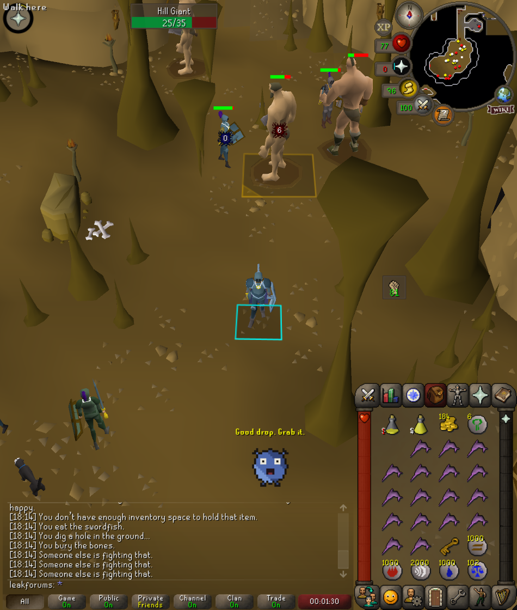
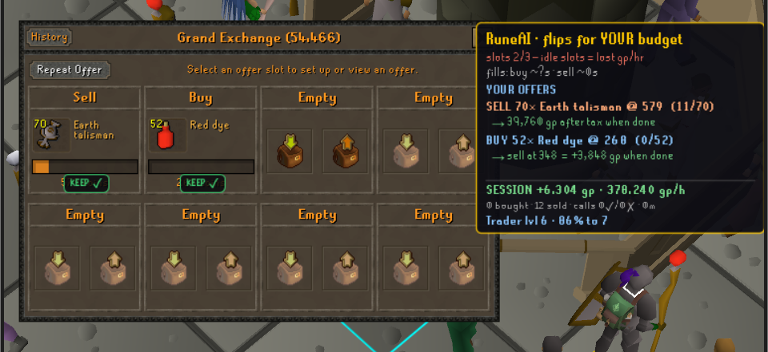

# RuneAI — an AI buddy for Old School RuneScape (RuneLite plugin)

RuneAI is a RuneLite plugin that puts an AI companion next to you while you play Old School RuneScape. It watches the live game state every tick and helps *you* play: it flashes the next thing to click when you go idle, outlines what is attacking you, shouts "eat" before you die, marks drops that are actually worth money, and keeps a running session profit/loss ledger. It does **not** click, move, or play the game for you — there is no automation of input anywhere in the code. Every decision and every click stays yours; RuneAI just makes sure you click the right thing at the right time.

Repository: https://github.com/lordbasilaiassistant-sudo/runeai

Last updated: 2026-08-09

## What RuneAI is (buddy, not bot)

RuneAI is an AI assistant / AI companion overlay for OSRS. The plugin reads the RuneLite API — your skills, inventory, nearby NPCs, ground items, animations — and turns that into on-screen guidance and spoken voice callouts. It contains no input automation: no mouse movement, no keyboard injection, no pathing, no scripted actions. The mascot, "Rune", is a drawn overlay character that lip-syncs to the voice lines so the coaching feels like someone is actually sitting with you.



*RuneAI in action at the Hill Giants: Rune (the pixel mascot, bottom) speaking a loot callout in classic OSRS overhead text, with the player's target tile-marked.*

## Features

### Idle click guidance with activity detection
RuneAI infers what you are doing from real XP drops (`StatChanged`, only counting XP increases, so stat boosts don't fool it). Recognised activities: **Combat, Fishing, Mining, Woodcutting, Cooking, Smithing, Crafting** — anything else is reported by skill name. If you stand still for 4+ game ticks with no animation and no interaction target, RuneAI finds the nearest matching thing to click within 26 tiles (the search rejects anything at distance 27 or more) and flashes its tile with an animated green marker, a bobbing arrow, and a `Click: <name>` label. Guidance re-fires at most once every 6 ticks.

| Activity | What it looks for |
| --- | --- |
| Combat | Nearest free NPC with the same NPC id as your last target |
| Fishing | Nearest NPC whose name contains "Fishing spot" |
| Mining | Nearest game object named `*rocks*` |
| Woodcutting | Nearest object named `*tree*` |
| Cooking | Nearest `range`, `fire`, or `stove` |
| Smithing | Nearest `anvil` or `furnace` |
| Crafting | Nearest `furnace`, `spinning wheel`, or `loom` |

### Combat outlines
Any NPC currently interacting with you is model-outlined in red and name-labelled. The NPC you are attacking is outlined in cyan. When something starts attacking you and you were not already fighting, RuneAI says "You're under attack."

### Low-HP EAT alert (food-aware)
While under attack, if your boosted Hitpoints level drops to or below the configured percentage of your real Hitpoints level, RuneAI checks whether you actually have anything edible — it counts inventory items carrying the `Eat` inventory action:

- **Food in the bag:** a pulsing top-centre banner reads `EAT — HP <current>/<max>` and the voice line "Low health. Eat now." plays.
- **No food left:** the banner reads `NO FOOD — get out / bank` and the `bank` voice line plays instead. This variant is rate-limited to once per 100 game ticks.

Threshold defaults to 33%.

### Pot-up reminder
While your detected activity is Combat, RuneAI scans your inventory for potions (Strength, Attack/Combat, Defence, Ranging, Magic). If the matching skill is not currently boosted above its real level, it shows `Pot up — <item name>` and says "Pot up. Drink your potion." Rate-limited to once per 100 game ticks.

### Smart loot flashes with a GE min-value filter
Every item that spawns within 8 tiles is priced with the RuneLite `ItemManager` GE price times quantity. If the value meets or exceeds **Min loot value (gp)** (default 100), the tile gets a pulsing gold marker labelled `<item> · <value> gp` and the voice says "Good drop. Grab it." Junk drops stay silent.

Items **you** dropped are never flashed as loot: if you clicked `Drop` on that item id within the last 3 ticks, the spawn is booked as your own drop and feeds the gp-vs-xp goal signal below instead.

### gp grind vs xp grind (goal inference)
RuneAI compares the GE value you have gained against the GE value you have dropped this session. Once dropped value reaches half of gained value, the session is classified `xp` (power-training); otherwise `gp`. The sidebar shows it next to the activity (`Combat · gp`), it is written into every tick vector as `goal`, and it changes behaviour — a power-trainer is never told to bank a full inventory.

### Bank-it nudge
If your inventory hits 28 items while you are doing a **non-combat** activity, the session goal is **not** `xp`, and you have not dropped anything in the last 150 ticks, RuneAI shows `Inventory full — bank it` and says "Inventory full. Bank your items."

### F2P bond ladder
On a free-to-play world, RuneAI tracks how close you are to buying an Old School Bond. Roughly every 50 ticks it prices the bond from the GE and compares it against your total worth — inventory + equipment, plus your bank as of the last time you opened it. The sidebar shows a **Bond fund** row as a percentage (`63% of 12,000k`, with a `*` while the bank has never been opened this session, `members ✓` on a members world). When your worth first covers the bond price, a `You can afford a BOND — go members!` alert fires once with the voice line "You can afford a bond. Time to go members."

### Kokoro voice callouts (local, offline)
Voice is seven pre-rendered WAV files (mono 16-bit PCM, 24 kHz) generated with local Kokoro TTS and bundled as plugin resources in `src/main/resources/com/runeai/voice/`:

| Key | Line |
| --- | --- |
| `idle` | "You're idle. Click the highlighted tile." |
| `eat` | "Low health. Eat now." |
| `bank` | "Inventory full. Bank your items." |
| `loot` | "Good drop. Grab it." |
| `attacked` | "You're under attack." |
| `pot` | "Pot up. Drink your potion." |
| `bond` | "You can afford a bond. Time to go members." |

Playback goes through a single-thread speech queue, so lines never overlap — one finishes (plus a 400 ms breath) before the next starts, and if two lines are already queued, new ones are dropped rather than backlogged. Each line also has a 12-second per-key cooldown so RuneAI never nags. No network call is ever made to speak — there is no TTS API in this plugin.

### Rune, the mascot — OSRS-style pixel pet with real lip sync
`MascotOverlay` draws Rune as a chunky pixel-art imp in the game's own visual language: flat shading bands (no gradients), a dark sprite outline, two horns, stub feet, randomised blinking, and a bob quantised to whole pixels so it moves like a retro sprite. It speaks in classic OSRS overhead text — yellow with a hard black shadow — rather than a modern bubble. The mouth is three retro visemes (closed / half / open) driven by a **real amplitude envelope**: `VoicePlayer` decodes the WAV to PCM, computes an RMS value per ~33 ms hop normalised to the clip's peak, then samples that envelope from the clip's actual frame position during playback. The mouth follows the audio, not a fake loop. The mascot overlay is movable — **hold Alt and drag** to park it anywhere on screen (standard RuneLite overlay dragging).

### GE flipping copilot + the TRADER skill



While the Grand Exchange is open, RuneAI becomes a flipping copilot — all in the game window:

- **Live suggestions** from the wiki prices API: whole-market scan every 5 minutes, filtered to your world type (F2P/P2P), your carried coins, and your Trader level tier, ranked by achievable gp/hr with your capital. Stale-spread mirages are filtered out (both sides must have traded within 10 minutes, ROI capped at 30%).
- **Offer-setup coach**: open any item's setup screen and see its live buy/sell prices, hourly traded volume, buy limit, suggested quantity and total projected profit (sell setups suggest your full held stack and show after-tax proceeds).
- **Open positions with exit plans**: every live buy shows the sell target and expected profit on completion; sells show post-tax proceeds — with fill progress.
- **Verdict stamps on the offer slots themselves**: `KEEP ✓`, `SLOW · reprice?` after 5 unfilled minutes, `CANCEL · rebuy <price>` when the market moves past you, `ABORT — margin gone`.
- **Honest accounting**: profit = sell − buy − 2% GE tax (floored per item, sub-50gp sales untaxed), booked per partial fill the moment it happens, cost basis persisted across restarts. Session footer: realized P&L, gp/h, units traded, suggestion win/loss record.
- **The TRADER skill**: positive flip profit awards XP on the genuine OSRS experience curve (0.1 xp per gp — level 99 represents roughly 130M lifetime profit). Each level raises the maximum item value the advisor will suggest, so your bankroll and your skill climb together. Level-ups get the full treatment: banner, voice line, mascot celebration.

RuneAI never places, modifies, or cancels offers — every click is yours.

### Session P&L ledger
RuneAI keeps a live gp ledger of your session, shown as **Session P&L** in the sidebar panel and written into the tick vectors as `pnl`.

Exact accounting rules, as implemented:

- The tracked holding is **inventory + equipment**, summed by item id and quantity. The bank is not counted.
- On every inventory or equipment container change, the new holding is diffed against the previous holding, and each per-item quantity delta is multiplied by that item's value.
- Item value = GE price from `ItemManager`, except coins (`ItemID.COINS_995`), which are valued at exactly 1 gp each.
- The ledger is **paused** while a transfer interface is open — widget groups **12** (bank), **465** (Grand Exchange), **192** (deposit box) and **300** (shop). Depositing to the bank or buying on the GE therefore does not register as profit or loss; the holding baseline is still refreshed so nothing double-counts when the window closes.
- Loot picked up and items gained count up; items dropped, consumed, or lost count down.
- Returning to the login screen clears the **holding baseline** (`lastHolding`), so logging back in does not book your whole kit as profit. The running total itself is **not** reset — `sessionPnl` keeps counting for as long as the plugin stays enabled, across logouts and world hops.
- Each non-zero change also emits a `pnl` event with `delta` and `total`.
- Positive deltas additionally feed `gainedValue`, one half of the gp-vs-xp goal signal.

### Full data layer + trainable tick vectors
Three local recording streams, all written to `~/.runelite/runeai/`:

1. **`ticks-<timestamp>.jsonl`** — one fixed-shape vector per game tick: position (`x`, `y`, `plane`, `region`), `hp`/`hpMax`, `pray`, run `energy`, `spec`, `anim`, `pose`, `graphic`, `dmgTaken` (damage you took this tick — the built-in training label), `pnl`, `activity` (detected activity name or `null`), `goal` (`"gp"` or `"xp"`), `xpGained` (session XP total), `members` (members world flag), `worth` (total GE worth incl. last-seen bank), `equip` (worn item ids), `targetNpcId`, `npcCount`, and the nearest 8 NPCs each with `id`, `dist`, `anim`, `hr` (health ratio) and `atkMe`.
2. **`events-<timestamp>.jsonl`** — the live event stream, one JSON object per line shaped `{"t": iso-time, "tick": n, "e": type, ...}`. Event types emitted: `gameState`, `heartbeat`, `chat`, `stat`, `hitsplat`, `death`, `animation`, `graphic`, `graphicsObject`, `projectile`, `interacting`, `container`, `pnl`, `click`, `npcSpawn`, `npcDespawn`, `playerSpawn`, `playerDespawn`, `itemSpawn`, `itemDespawn`, `varbit`.
3. **`snapshot-<timestamp>.json`** — a full pretty-printed game-state dump written automatically 8 ticks after each login: meta/world info, local player, every entry of the RuneLite `Skill` enum with level/boosted/xp (24 skills plus `Overall` on RuneLite 1.12.35) followed by `totalLevel` and `overallXp`, inventory, equipment, bank, all NPCs, other players, ground items, nearby objects within 12 tiles, non-zero varps, open widget groups, camera, and the current menu entries.

`train/train_damage_model.py` trains a v1 danger model on the recorded ticks: pure-numpy logistic regression predicting **P(take damage within the next 3 ticks)**, using 9 features (`hpFrac`, `prayFrac`, `npcCount`, `nearestDist`, `nearestAtkMe`, `nearestAnim`, `attackersOn`, `inCombatAnim`, `bias`). It needs at least 500 recorded ticks and writes weights plus metrics (test accuracy, majority baseline, AUC) to `train/damage_model.json`. The design is deliberate: exported weights are a single dot product per tick inside the Java plugin — no sidecar process, no runtime dependencies. The script's own bar is `AUC > 0.75` before the model is worth wiring in as a live warning.

## Quick start (run from source)

RuneAI is **not on the RuneLite Plugin Hub yet**, so you run it from source in RuneLite developer mode.

Requirements: JDK 11+ and Git. Gradle is provided by the wrapper.

```bash
git clone https://github.com/lordbasilaiassistant-sudo/runeai
cd runeai
./gradlew run          # Windows: gradlew.bat run
```

`./gradlew run` launches RuneLite with `--developer-mode --debug` and the plugin on the classpath. Log in, and RuneAI greets you in the game chat, opens its sidebar panel (the blue "A" icon), and starts recording.

Optional, after you have played for a while:

```bash
py train/train_damage_model.py    # trains on ~/.runelite/runeai/ticks-*.jsonl
```

Build a shadow jar instead of running:

```bash
./gradlew shadowJar    # build/libs/runeai-unspecified-all.jar
```

(`build.gradle` sets no `version`, so Gradle stamps the archive name `unspecified`. The plugin's own version, `0.1.0`, lives in `runelite-plugin.properties`.)

## Configuration

All settings live under the **RuneAI** section of the RuneLite plugin config (config group `runeai`). Defaults below are the real defaults from `RuneAIConfig.java`.

| Setting | Key | Type | Default | What it does |
| --- | --- | --- | --- | --- |
| Login greeting | `greeting` | String | `Welcome back` | Message RuneAI sends in chat when you log in |
| Log live events | `logEvents` | boolean | `true` | Stream all game events to `.runelite/runeai/events-*.jsonl` (restart plugin to apply) |
| Log varbit changes | `logVarbits` | boolean | `true` | Include raw varbit/varp changes in the event stream (very chatty on login) |
| Track session profit/loss | `trackPnl` | boolean | `true` | Live gp ledger; banking/GE are neutral transfers |
| Show mascot | `showMascot` | boolean | `true` | Rune, the lip-syncing companion — Alt-drag to move it anywhere |
| Voice callouts | `voiceCallouts` | boolean | `true` | Spoken guidance: idle nudges, eat warnings, bank reminders, loot calls |
| Min loot value (gp) | `minLootValue` | int | `100` | Only flash and call out drops worth at least this much |
| Show overlays | `showOverlays` | boolean | `true` | Draw combat outlines, tile flashes, and alerts on the game view |
| Idle click guidance | `guideIdle` | boolean | `true` | When you go idle mid-task, flash the tile of the next thing to click |
| Potion reminder | `potReminder` | boolean | `true` | Remind you to drink a boost potion when fighting unpotted with one in your inventory |
| Low HP alert | `lowHpWarn` | boolean | `true` | Show an EAT warning when under attack with low hitpoints |
| Low HP threshold % | `lowHpPercent` | int | `33` | HP percent that triggers the EAT warning |
| Record tick vectors | `recordTicks` | boolean | `true` | Write a fixed-shape state record every game tick to `.runelite/runeai/ticks-*.jsonl` (restart plugin to apply) |
| Heartbeat interval (ticks) | `heartbeatTicks` | int | `10` | Write a compact player-state line to the event stream every N game ticks |

## Sidebar panel

The RuneAI panel shows Game state, Player, detected Activity (formatted `<activity> · <goal>`, e.g. `Mining · gp`), Session P&L (green when positive, red when negative), Bond fund, NPCs loaded, Players loaded, and Events logged — plus the data directory footer and a **Support us on Ko-fi** button.

## Data & privacy

- **Everything recorded stays on your own machine.** All three streams are written to your local disk.
- **The plugin makes no network requests.** There is no telemetry, no analytics, no upload, and no remote AI service call anywhere in the source. Voice is local WAV playback; guidance is local rule code; the danger model trains locally in numpy.
- Recorded files can contain your account name and other players' names, so the repository's `.gitignore` excludes `*.jsonl`, `snapshot-*.json`, and `train/damage_model.json`. Recorded data is never committed.
- To stop recording entirely, turn off **Log live events** and **Record tick vectors** and restart the plugin. To delete recordings, delete the files in `~/.runelite/runeai/`.

## FAQ

### Is RuneAI a bot?
No. RuneAI never sends input to the game. It has no mouse control, no keyboard control, no pathing and no action automation — it only reads game state and draws overlays or plays a voice line. You do all the clicking.

### Does RuneAI send my data anywhere?
No. The plugin makes no outbound network requests. Tick vectors, the event stream, and login snapshots are written only to `~/.runelite/runeai/` on your computer, and the repo's `.gitignore` keeps them out of git.

### How do I move the mascot?
Hold **Alt** and drag Rune with the mouse — the mascot is a movable RuneLite overlay and defaults to the bottom-right of the game view. Hide it entirely with the **Show mascot** config toggle.

### Why are the voice files local?
All eight callout lines were pre-rendered with local Kokoro TTS and shipped as WAV resources inside the plugin. That means zero latency, zero API cost, zero API keys, and no audio or game data ever leaving your machine.

### Is RuneAI on the RuneLite Plugin Hub?
Not yet. Today you run it from source with `./gradlew run`.

### Can I turn features off individually?
Mostly. Overlays, voice, mascot, idle guidance, pot reminder, low-HP alert, P&L tracking, and both recording streams each have their own toggle (see the configuration table). The bank nudge and the F2P bond ladder currently have no dedicated switch — turning off **Show overlays** and **Voice callouts** silences them.

## Support

RuneAI is free. If it helps you, you can support development on Ko-fi: **https://ko-fi.com/broketobuilt** — there's also a Ko-fi button right in the plugin's sidebar panel.

## Status & roadmap

Version 0.1.0, in active development, tested on free-to-play. Not yet submitted to the RuneLite Plugin Hub.

Next up:
- Ship the trained danger model as JSON weights read by the plugin, turning the recorded ticks into a live "you're about to take damage" warning.
- Broaden activity detection beyond the current seven activities and the current object keyword lists.
- More voice lines and a Plugin Hub submission once the guidance set is stable.
